# Projeto do TeamHL

Projeto de Pi da escola. Nossa equipe se chama TeamHL e criamos um jogo SinglePlayer/MultiPlayer baseado em Bioenergética, o tema que nos foi dado de biologia.

# Forest Core

# Menu
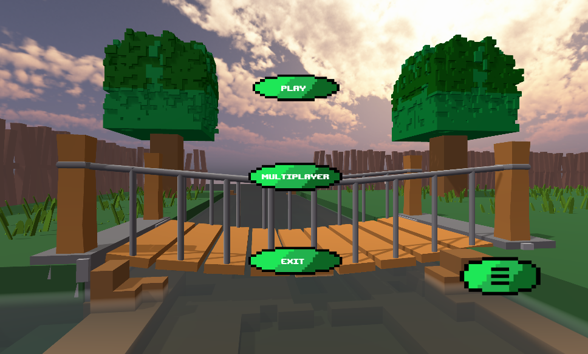

# Tutorial
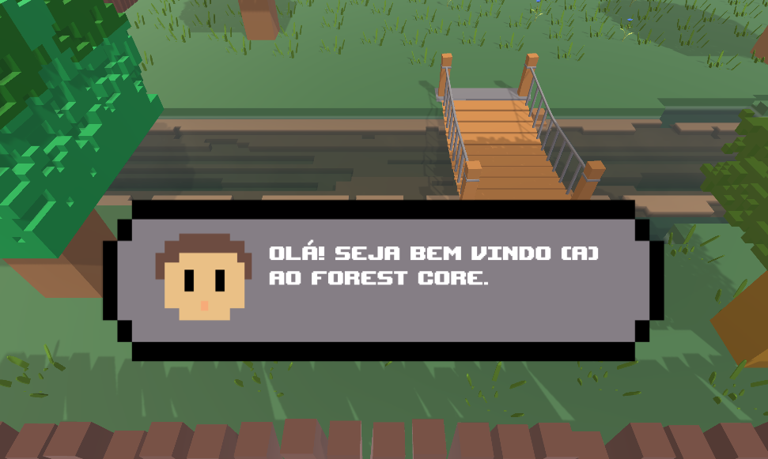

# Puzzle Estufa
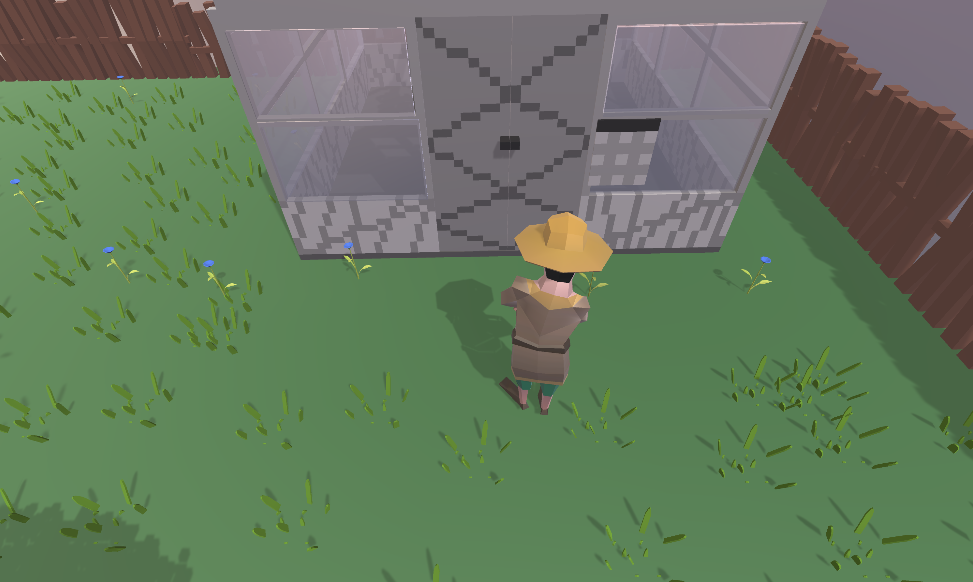
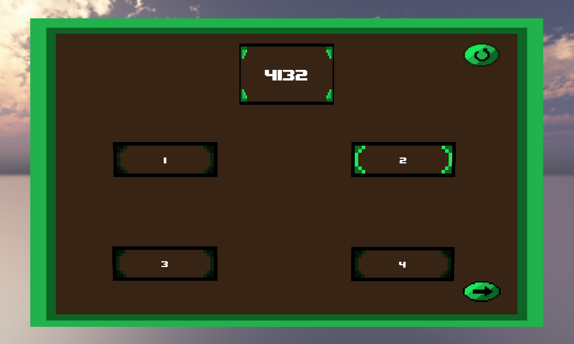

# Puzzle Casa
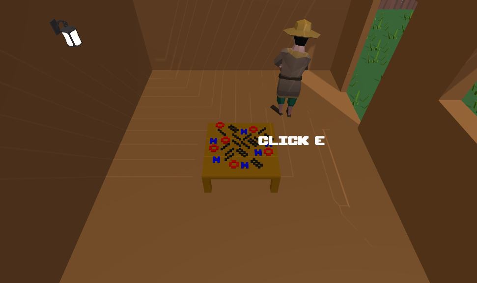
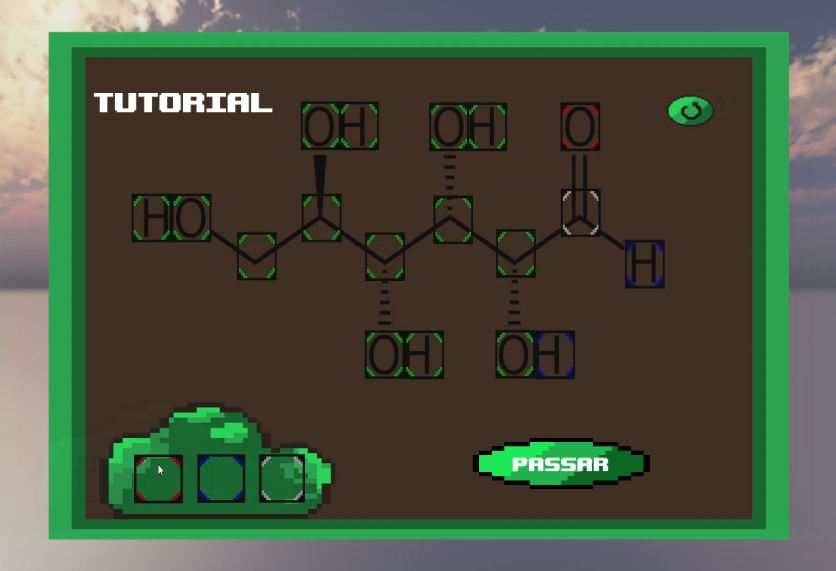
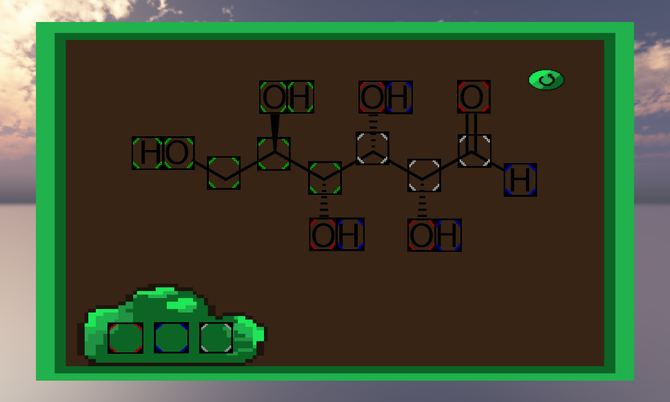

# Puzzle Poço
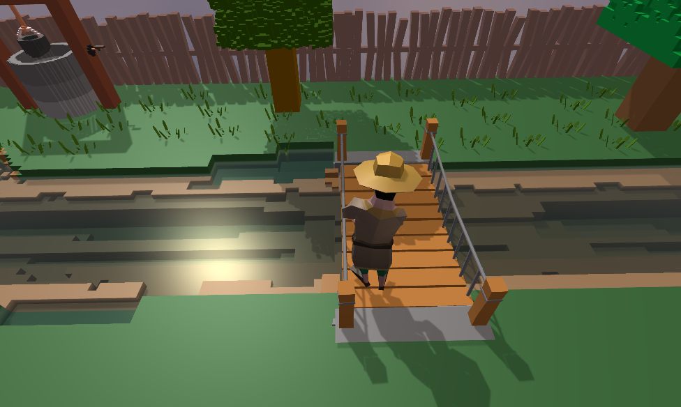
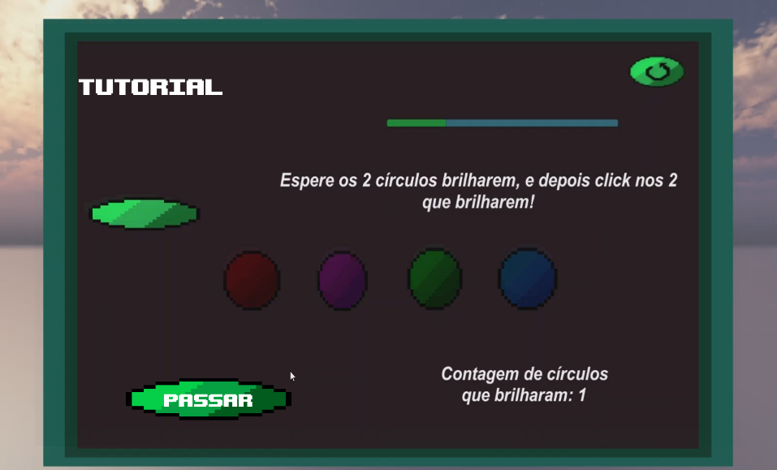
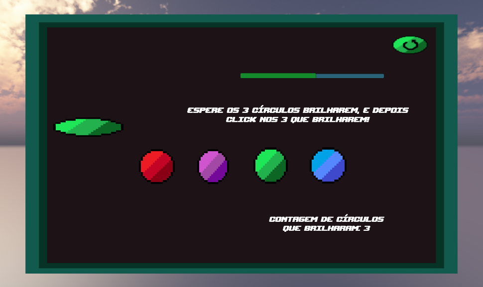

# Mapa do Jogo
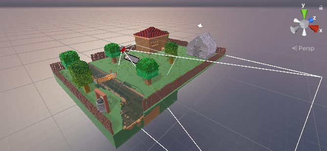

# MultiPlayer

# Informações do Jogo
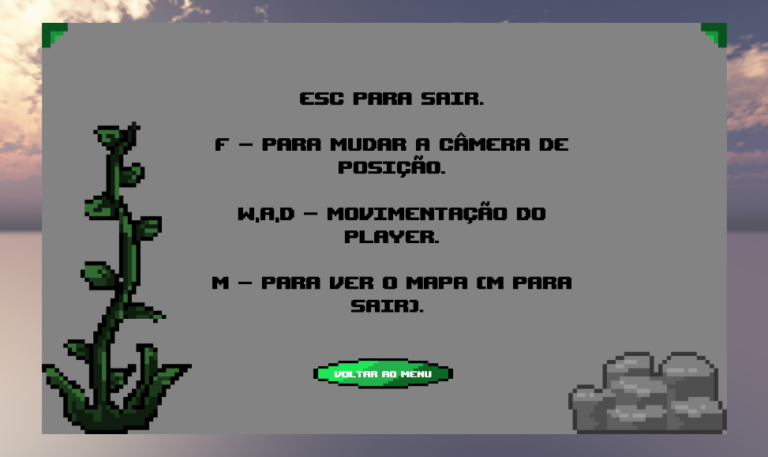
