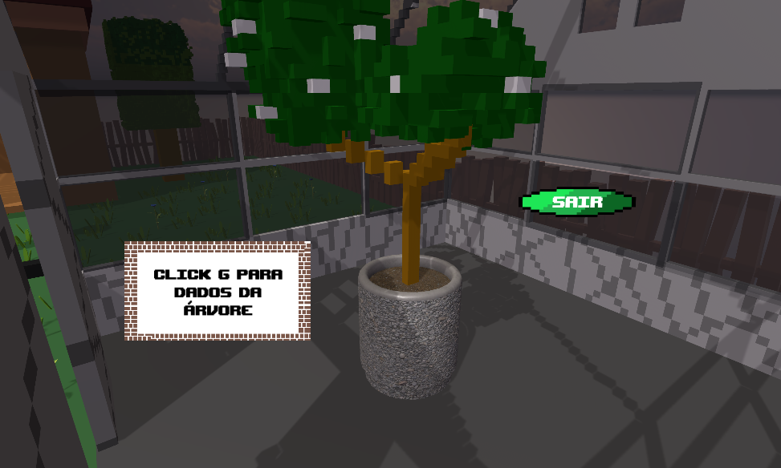

# Projeto do TeamHL

Projeto de Pi da escola. Nossa equipe se chama TeamHL e criamos um jogo SinglePlayer/MultiPlayer baseado em Bioenergética, o tema que nos foi dado de biologia.

# Forest Core

# Menu

# Tutorial

# Puzzle Estufa

# Puzzle Casa

# Puzzle Poço

# Mapa do Jogo

# MultiPlayer

# Informações do Jogo

